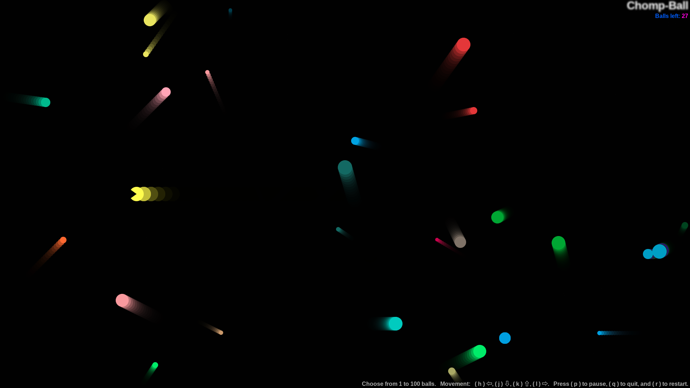
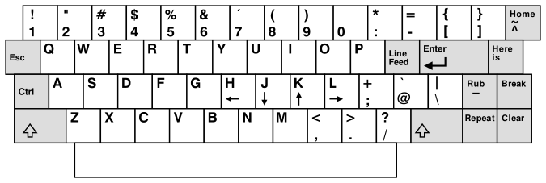

# Chomp-Ball

Gotta Chomp 'em all.

This is an extension of the MDN Web Docs tutorial: 
[bouncing balls demo](https://bideinsilence.github.io/objectBuildingPractice).

I've built this tutorial out into a Pac-Man like tool (game) that uses the
[ADM-3A and subsequently vi (and its derivatives)](https://en.wikipedia.org/wiki/ADM-3A)
cursor movement keys to move your Chomp-Ball character around the screen and
help establish those movements to the point of no longer having to think
about their placements when using. A and idea that helped me when I was first
learning was to think of the j key as sort of looking like a down arrow.

## Directions:
- Choose from 1 to 100 balls
- Move: ( h ) ⇦, ( j ) ⇩, ( k ) ⇧, ( l ) ⇨
- ( p ) to pause
- ( q ) to quit
- ( r ) to restart

**Play this live:** https://bideinsilence.github.io/chomp-ball/

## How it's made:
HTML, CSS, Javascript, and the Canvas and requestAnimationFrame APIs

## Optimizations:
With more time I would implement:
- A refactor of my code to be more effecient and/or easier to understand
- A possible static class or namespacing object to contain my global variables,
  or consider a closure or further encapsilation of my variables with their
  functions.
- Support for 2 players
- An option to increase difficulty (speed) of the balls
- "Enemies" made out of the larger balls and some sort of power-up to chomp and
  then have a short period of time to "eat" those "enemies"
- An additional animation state between the open and closed mouth of Chomp-Ball
  for a smoother animation experience
- And with enough interest, I could build this out to be a more proper and full
  Pac-Man with vi movement keys clone

## Lessons Learned:
This was an exciting, challenging, visually dynamic, and interactive opportunity
to practice working with JavaScript classes, some of the browser APIs, and the
programming logic to gamify and build a simple tool to that can ingrain the
basic vi cursor movements into your muscle memory. My only regret is that I
didn't version control this project sooner so that I could look back through the
steps I took if I ever have the need.

